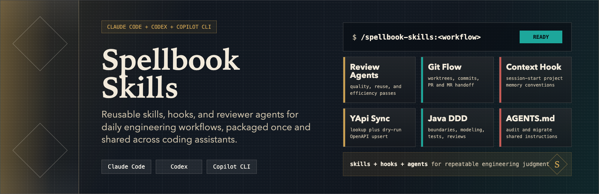
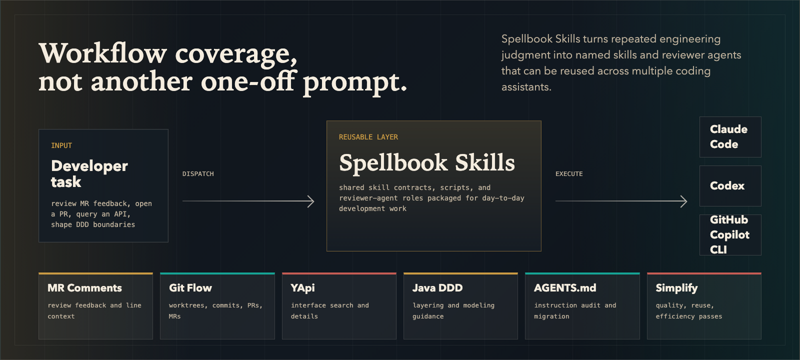

# Spellbook Skills

<p align="center">
  
</p>

<p align="center">
  <a href="./LICENSE"></a>
  
  
  
  
</p>

面向日常工作流的个人技能仓库，提供 Claude Code、GitHub Copilot CLI 与 Codex 插件配置。

[English README](./README.md)

## 概览

Spellbook Skills 是一组面向日常开发工作流的 Agent 技能集合，涵盖测试驱动开发、git worktree、代码审查、API 查询、DDD 架构指导等方面。此外还提供 **Project Context Hook**，在主会话和子代理启动时向 Agent 注入框架无关的项目记忆库约定（详见下方 [Project Context Hook](#project-context-hook项目记忆库) 一节）。

<p align="center">
  
</p>

## 依赖

- Claude Code v1.0.33+
- GitHub Copilot CLI（用于 Copilot 插件、skill 与 agent）
- Codex CLI（用于 Codex 插件与 Codex agent role）

## 安装到 Claude Code

Claude Code 交互命令：

```
/plugin marketplace add yyykf/spellbook-skills
/plugin install spellbook-skills@spellbook-marketplace
/reload-plugins
```

终端命令：

```bash
claude plugin marketplace add yyykf/spellbook-skills
claude plugin install spellbook-skills@spellbook-marketplace --scope user
```

市场名称是 `spellbook-marketplace`，由 `.claude-plugin/marketplace.json` 声明。

## 安装到 GitHub Copilot CLI

GitHub Copilot CLI 可以直接安装同一个远程 marketplace，并复用 Claude 兼容的 `.claude-plugin/plugin.json`，因此会同时加载 `skills/` 和 `agents/`。

```bash
copilot plugin marketplace add yyykf/spellbook-skills
copilot plugin install spellbook-skills@spellbook-marketplace
```

后续更新：

```bash
copilot plugin marketplace update spellbook-marketplace
copilot plugin update spellbook-skills@spellbook-marketplace
```

该插件会提供共享 skills，以及 `.claude-plugin/plugin.json` 中声明的 reviewer agents。

## 安装到 Codex

先安装 Codex 插件市场和插件：

```bash
codex plugin marketplace add yyykf/spellbook-skills
codex plugin add spellbook-skills@spellbook-marketplace
```

Codex 可以通过插件系统加载本仓库的 skills，但自定义 reviewer agents 还不能随插件自动导入，需要额外安装为 Codex agent role TOML 文件。
安装脚本只依赖 shell/PowerShell 加 `curl` 或 `Invoke-WebRequest`，不需要用户环境有 Python。

项目级安装，推荐用于单个仓库：

```bash
curl -fsSL https://raw.githubusercontent.com/yyykf/spellbook-skills/main/scripts/install-codex-agents.sh | bash
```

用户级安装，所有仓库可用：

```bash
curl -fsSL https://raw.githubusercontent.com/yyykf/spellbook-skills/main/scripts/install-codex-agents.sh | bash -s -- --scope user
```

本地仓库执行：

```bash
./scripts/install-codex-agents.sh --scope project
```

Windows PowerShell：

```powershell
$script = Join-Path $env:TEMP "install-codex-agents.ps1"
Invoke-WebRequest https://raw.githubusercontent.com/yyykf/spellbook-skills/main/scripts/install-codex-agents.ps1 -OutFile $script
powershell -NoProfile -ExecutionPolicy Bypass -File $script -Scope project
```

Windows 本地仓库里也提供了 `scripts/install-codex-agents.cmd` 和 `scripts/install-codex-agents.bat`，它们只是很薄的 PowerShell wrapper。

安装脚本会把带命名空间的 Codex roles 写到 `agents/spellbook`：

- 项目级：`./.codex/agents/spellbook/*.toml`
- 用户级：`${CODEX_HOME:-$HOME/.codex}/agents/spellbook/*.toml`

默认不会覆盖已有文件；需要覆盖时使用 `--force` 或 `-Force`。

## 使用

安装后，技能以插件名作为命名空间：

```
/spellbook-skills:<skill-name>
```

## 技能列表

| Skill | 说明 |
| --- | --- |
| `using-git-worktrees-lite` | 从当前分支创建 worktree，仅构建/编译校验（不跑测试） |
| `finishing-a-development-branch-lite` | 以构建/编译为完成门槛，按选项合并/PR/保留/丢弃并清理 worktree |
| `reviewing-gitlab-mr-comments` | 使用 glab 查看 GitLab MR 评论，汇总反馈并给出清单或计划后再执行 |
| `yapi-skill` | 免服务读写 YApi：搜索接口、获取接口详情，并从 OpenAPI 契约同步（upsert）单个接口文档（Python 标准库脚本直连，默认 dry-run） |
| `simplify` | 三维并行审查变更代码（复用性、质量、效率），自动修复发现的问题；Codex 可使用上面额外安装的带命名空间 reviewer agents |
| `ddd-best-practices` | DDD 架构最佳实践（Java/Spring Boot）— 分层决策、领域建模、代码模板、测试策略、审查清单与 MVC 渐进迁移 |
| `test-driven-development` | 测试驱动开发：红-绿-重构纪律 + Kent Beck 的 Tidy First（结构/行为改动分离）与 Canon 测试清单；语言无关主体，附 Java/TS/Python/Go/Rust 各语言专属注意事项 |
| `git-commit` | 基于真实 diff 准备 Git 提交：先读仓库规范，判断是否需要原子拆分，运行轻量校验，并生成 Conventional Commit；emoji 仅在 `--emoji` 时放到 `type(scope):` 之后 |
| `git-merge-request` | 一键提交 + 推送 + 创建合并请求，自动识别 GitHub / GitLab 远端，优先使用仓库内 PR/MR 模板 |
| `agents-md-improver` | 维护简洁的 AGENTS.md 项目指令：审计现有指令、沉淀会话经验，并将有价值的 CLAUDE.md 规则迁移为共享 Agent 指令 |

## Project Context Hook（项目记忆库）

**可选**的 SessionStart/SubagentStart hook，在主会话和子代理启动时注入框架无关的 `.project_context/`「项目记忆库」约定。它是增强能力，并非使用插件 skills 的必需步骤。

- **Claude Code**：启用插件即自动生效，子代理启动也会注入，无需安装。
- **Codex 0.137.0+**：启用插件后自动加载插件内 `hooks/hooks.json`，子代理启动也会注入；首次需在 Codex 中跑一次 `/hooks` 信任该 hook。
- **Copilot / 旧 Codex fallback**：安装脚本默认只写 Copilot personal instructions；旧 Codex 或明确需要 `~/.codex/hooks.json` 固定安装时，显式选择 fallback target。无需 clone 仓库：

  ```bash
  curl -fsSL https://raw.githubusercontent.com/yyykf/spellbook-skills/main/scripts/install-project-context-hook.sh | bash                                      # Copilot（默认）
  curl -fsSL https://raw.githubusercontent.com/yyykf/spellbook-skills/main/scripts/install-project-context-hook.sh | bash -s -- install --target auto            # 自动判断旧 Codex fallback
  curl -fsSL https://raw.githubusercontent.com/yyykf/spellbook-skills/main/scripts/install-project-context-hook.sh | bash -s -- install --target codex-fallback  # 旧 Codex fallback
  ```

  Windows 改用 `install-project-context-hook.ps1` 安装脚本（见下方完整指引）。若已 clone 仓库，也可跑 `python3 hooks/install.py install`；旧 Codex fallback 可先试 `python3 hooks/install.py install --target auto`，确认旧版本或明确固定写入时用 `--target codex-fallback`。走 Codex fallback 安装后同样需启动 Codex 跑一次 `/hooks` 信任该 hook。

完整指引（安装 / 卸载、三平台差异、设计说明）见 [docs/project-context-hook.zh-CN.md](./docs/project-context-hook.zh-CN.md)。

## 路线图

- 逐步补充更多成熟的工作流技能

## 许可证

MIT，详见 [LICENSE](./LICENSE)。

## 贡献

欢迎提交 Issue 与 PR，请保持修改范围小而明确。

## 致谢

- 本仓库参考并改写了 [superpowers](https://github.com/obra/superpowers) 的技能与流程设计，在此致谢。
- `ddd-best-practices` 技能的设计灵感与实践经验来自 [xfg-ddd-skills](https://github.com/fuzhengwei/xfg-ddd-skills)，特此致谢。
- `agents-md-improver` 技能参考了 Anthropic 的 [claude-md-management](https://github.com/anthropics/claude-plugins-official/tree/main/plugins/claude-md-management)，并适配为面向 AGENTS.md 兼容编码 Agent 的通用指令维护流程。
- `test-driven-development` 技能在 [superpowers](https://github.com/obra/superpowers) 的 TDD 技能基础上，融入 Kent Beck 的 Tidy First 与 Canon TDD（出自其 *Augmented Coding: Beyond the Vibes* 与 *Canon TDD* 文章），在此一并致谢。
